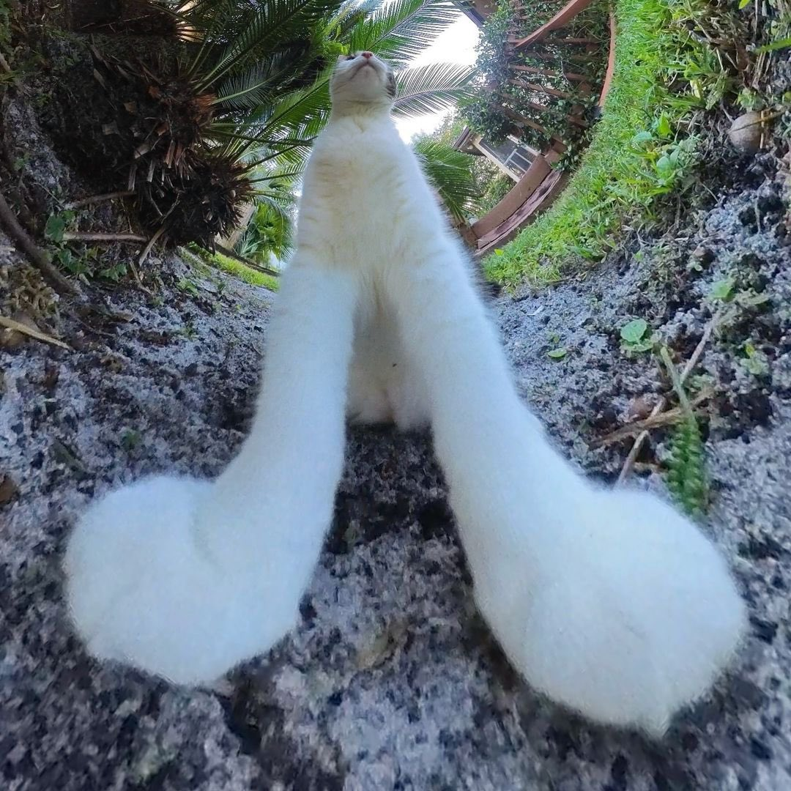

<html lang="en">
    <head>
        <title> Scrap </title>
          <link rel="stylesheet" href="https://johnjonhjoaojuan.github.io/scrap/assets/css/style.scss" media="print" onload="this.media='all'"> 
          <!-- "Inter" Font -->
          <link rel="preconnect" href="https://rsms.me/">
          <link rel="stylesheet" href="https://rsms.me/inter/inter.css">
            
    </head>
    <body>
        

            <h1 class="bt">CONTENT COMING SOON...?</h1>
             
            
        

      </body>
  </html>
  