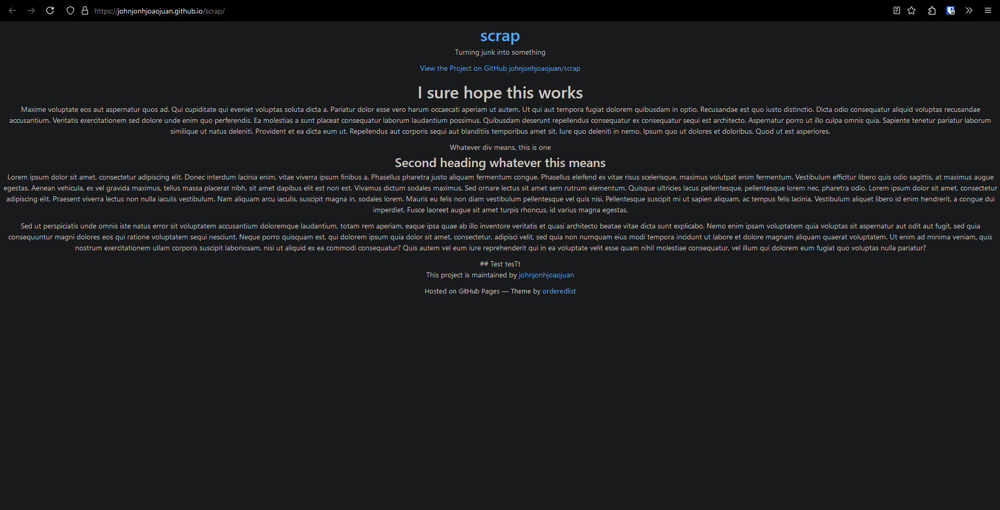

<html lang="en">
    <head>
        <title> Scrap </title>
          <link rel="stylesheet" href="https://johnjonhjoaojuan.github.io/scrap/assets/css/style.scss" media="print" onload="this.media='all'"> 
          <!-- "Inter" Font -->
          <link rel="preconnect" href="https://rsms.me/">
          <link rel="stylesheet" href="https://rsms.me/inter/inter.css">
            
    </head>
    <body>
        <!-- This id is where the back to top button returns to-->
        
        <!--
        <label class="switch">
            <input type="checkbox">
            
        </label>
        -->
         
         
        <h1 class="bt">hi</h1>
        

            <h2>Welcome</h2>
            
to the jonh page

            
             
    <!-- Old html image code -  -->
                

                    
                

                

                    
                    
                    
                    
                

        
Click on the screenshot above 

        <h2> To-Do List </h2>
            <ol>
                <li>Reader Mode</li>
                <li>Change Font?</li>
                <li>Update the Navigation Page</li>
                <li>Fix screen size issues</li>
                <li>Bug where elements aren't aligned until you start scrolling to fix</li>
                <li>Sidebar - add stuff</li>
                <li>Add some buttons (to sidebar maybe) to skip to certain parts of content</li>
                <li></li>
                <li></li>
                <li>DON'T FORGET TO HIDE THE TO-DO LIST!!!!</li>
            </ol>
             
            

                <a class="button cr" href="#top">Back to top</a>
                <!-- If the buttons stop working, reverse to this https://johnjonhjoaojuan.github.io/scrap/navigation template-->
                <a class="button cr" href="navigation.html">Navigation page</a>
            

        
        
    </body>
</html>